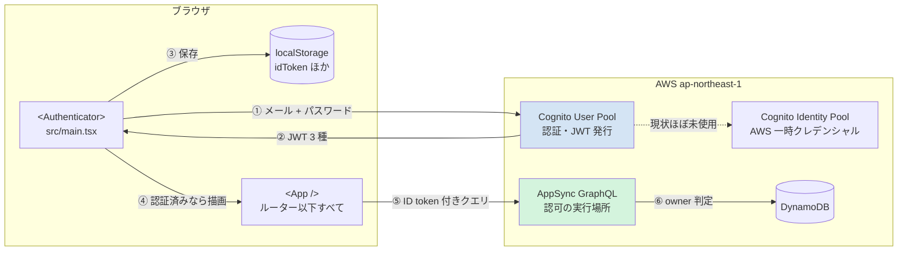
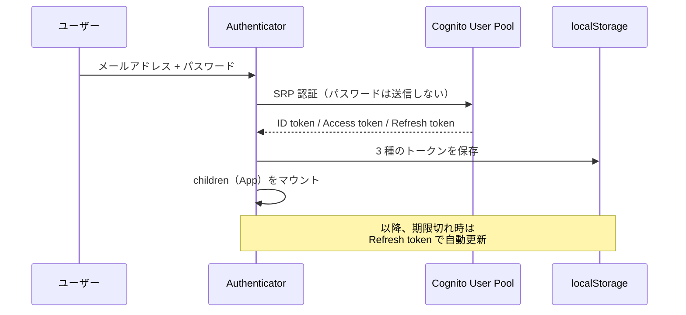
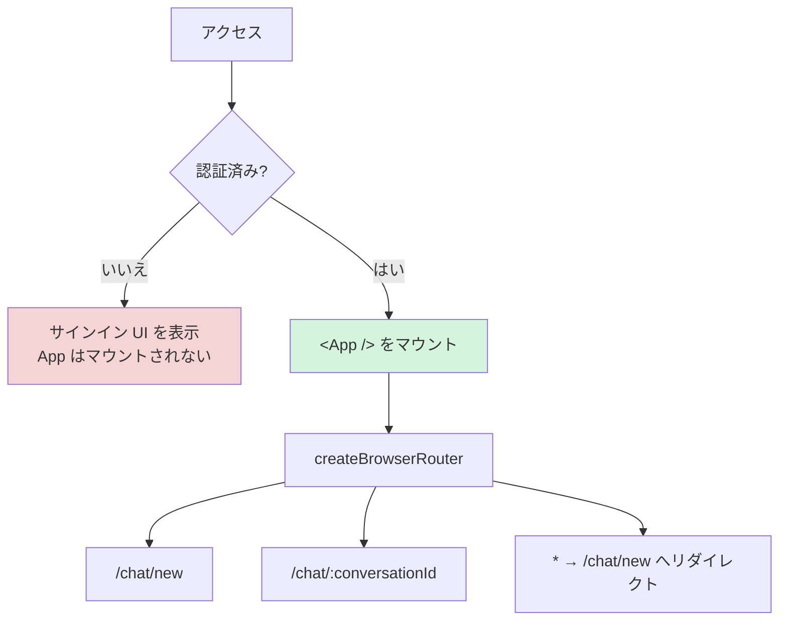
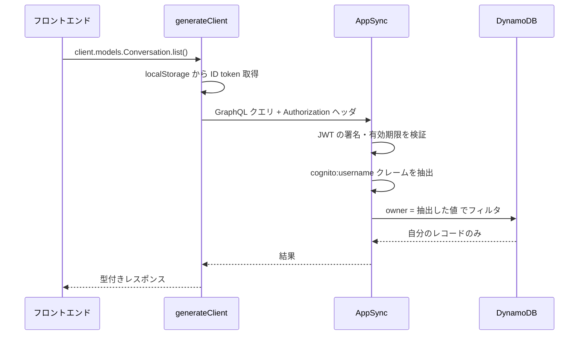
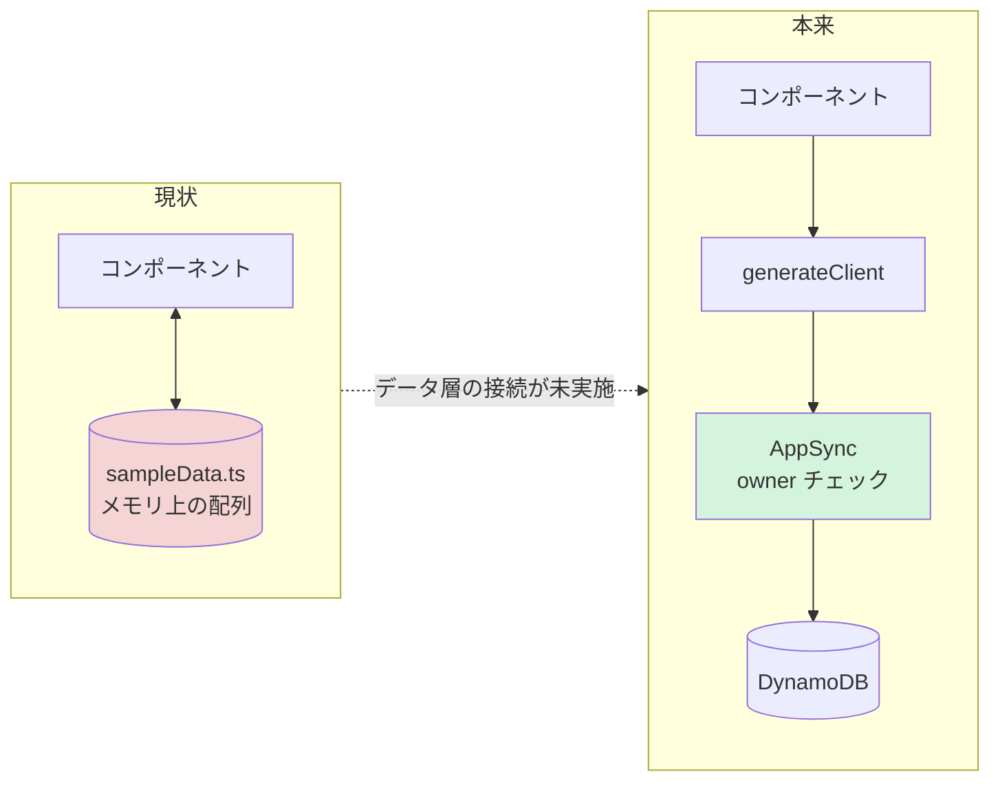
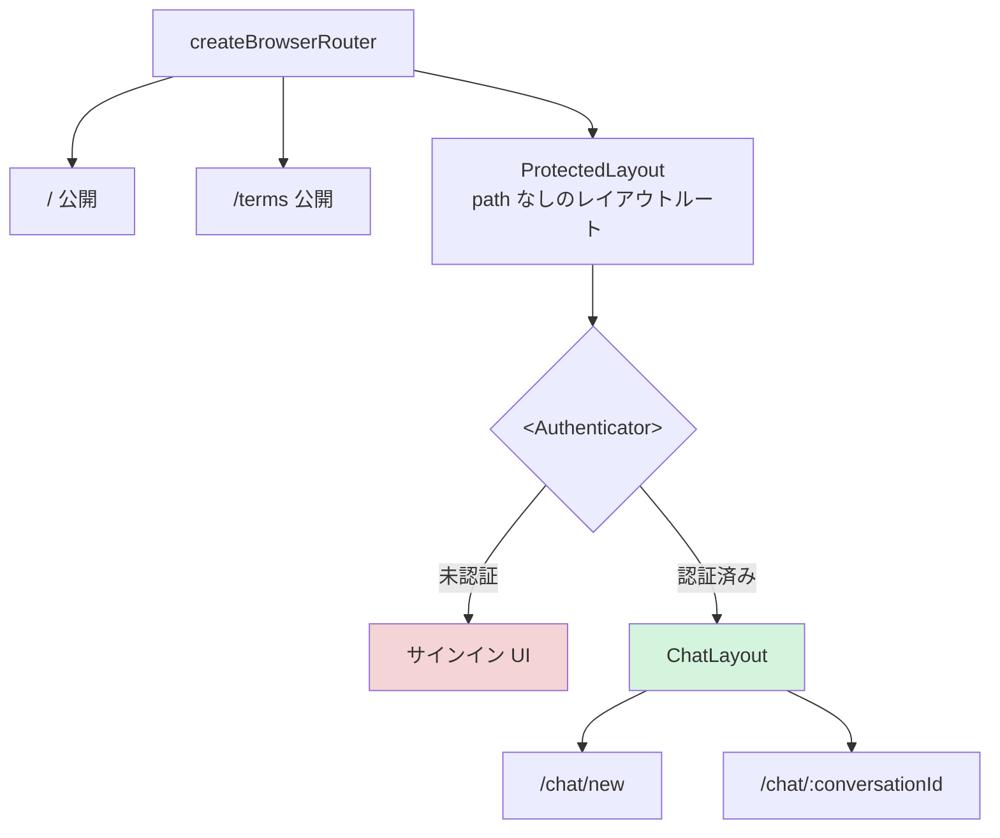

# 認証・認可

Amplify Gen 2 による認証（Authentication）と認可（Authorization）の構成をまとめます。

- **認証** = 「あなたは誰か」を確かめる → Cognito User Pool
- **認可** = 「そのデータを触っていいか」を判定する → AppSync の owner ルール

> **重要な原則**: 認可の判定は **すべて AppSync のサーバー側**で行われます。フロントエンドのコードは判定に一切関与しません。「自分のデータだけ絞り込む」処理をフロントに書く必要はなく、書くべきでもありません。

---

## 全体像



---

## 1. 生成されるリソース

[amplify/auth/resource.ts](../amplify/auth/resource.ts) のわずか 5 行から 3 つの AWS リソースが作られます。

```typescript
export const auth = defineAuth({
  loginWith: {
    email: true,
  },
})
```

| リソース         | ID（本環境）                  | 役割                                           |
| ---------------- | ----------------------------- | ---------------------------------------------- |
| User Pool        | `ap-northeast-1_E96B04j0b`    | ユーザーの登録・認証。JWT を発行               |
| User Pool Client | `1j9uo5gpvdqk6i4lfr1h8m9o1l`  | アプリからの接続口。シークレットなし（SPA 用） |
| Identity Pool    | `ap-northeast-1:64138bc4-...` | JWT を AWS の一時クレデンシャルに交換          |

### User Pool と Identity Pool の違い

混同しやすい部分です。

|                        | User Pool                      | Identity Pool                      |
| ---------------------- | ------------------------------ | ---------------------------------- |
| 答える問い             | 「このアプリのユーザーは誰か」 | 「AWS リソースをどこまで触れるか」 |
| 発行するもの           | JWT（ID / Access / Refresh）   | IAM 一時クレデンシャル             |
| 使う場面               | AppSync への認可               | S3 への直接アップロードなど        |
| 本プロジェクトでの利用 | ✅ 主役                        | ⚠️ 実質未使用                      |

### User Pool の実設定

`defineAuth` に書いたのは `email: true` だけなので、**これ以外はすべて Amplify のデフォルト値**です。

| 項目               | 値                                                 |
| ------------------ | -------------------------------------------------- |
| ログイン ID        | メールアドレス（`username_attributes: ["email"]`） |
| 必須属性           | email                                              |
| 本人確認           | メール宛の検証コード                               |
| パスワードポリシー | 8 文字以上 + 大文字・小文字・数字・記号すべて必須  |
| MFA                | 無効（`NONE`）                                     |
| グループ           | なし                                               |

パスワードポリシーが記号必須なのもデフォルト由来です。[src/main.tsx](../src/main.tsx) の `I18n.putVocabularies` で 5 種類のパスワードエラーを日本語化しているのは、このポリシーに対応するためです。

実際に反映された値は [amplify_outputs.json](../amplify_outputs.json) の `auth` セクションで確認できます（このファイルは `.gitignore` 対象で、`ampx sandbox` / CI が生成します）。

---

## 2. サインインのフロー



### SRP プロトコル

Amplify は SRP（Secure Remote Password）で認証します。**パスワード自体はネットワークに流れません**。クライアントとサーバーが互いに「相手がパスワードを知っている」ことを、パスワードを送らずに証明する方式です。

### 3 種のトークン

| トークン          | 中身                                      | 用途                 | 有効期限 |
| ----------------- | ----------------------------------------- | -------------------- | -------- |
| **ID token**      | `sub` / `email` / `cognito:username` など | **AppSync への認可** | 60 分    |
| **Access token**  | スコープ、`cognito:groups`                | Cognito API 操作     | 60 分    |
| **Refresh token** | —                                         | 上記 2 つの再取得    | 30 日    |

トークンの更新は Amplify が自動で行うため、アプリ側でリフレッシュ処理を書く必要はありません。

### 保存先は localStorage

`aws-amplify` の実装で確認できます。

```
node_modules/.../auth/dist/esm/providers/cognito/tokenProvider/tokenProvider.mjs
「It stores the tokens in `window.localStorage` if available」
```

保存キーは `accessToken` / `idToken` / `refreshToken` / `signInDetails` など。

> ⚠️ **localStorage は JavaScript から読めます。** XSS が発生するとトークンを盗まれます。外部スクリプトを追加する際は注意してください。タブを閉じたらログアウトさせたい場合は、以下でセッションストレージに変更できます。
>
> ```typescript
> import { cognitoUserPoolsTokenProvider } from 'aws-amplify/auth/cognito'
> cognitoUserPoolsTokenProvider.setKeyValueStorage(sessionStorage)
> ```

---

## 3. フロントエンド側のガード

### アプリ全体を `<Authenticator>` で保護

[src/main.tsx](../src/main.tsx)

```tsx
createRoot(document.getElementById('root')!).render(
  <StrictMode>
    <Authenticator>
      <App />
    </Authenticator>
  </StrictMode>,
)
```

未認証時は `<App />` が **そもそもマウントされません**。[src/routes.tsx](../src/routes.tsx) の `createBrowserRouter` 以下すべてが保護対象になります。



**ルート単位の `<ProtectedRoute>` は不要**という設計です。トレードオフは次の通り。

|               | 内容                                                         |
| ------------- | ------------------------------------------------------------ |
| ✅ メリット   | 保護漏れが原理的に起きない。ルート追加時に何も考えなくてよい |
| ❌ デメリット | 公開ページ（LP、利用規約など）が作れない                     |

公開ページ（LP、利用規約など）が必要になったら、`<Authenticator>` をルーターの内側へ移す改修が要ります。手順は [6. ページ単位で認証する場合](#6-ページ単位で認証する場合) を参照してください。

### `useAuthenticator` の使い方

| ファイル                                        | 呼び出し                                        | 取得するもの         |
| ----------------------------------------------- | ----------------------------------------------- | -------------------- |
| [Profile.tsx](../src/components/ui/Profile.tsx) | `useAuthenticator((context) => [context.user])` | ログイン中のユーザー |
| [NewChat.tsx](../src/pages/NewChat.tsx)         | `useAuthenticator((context) => [context.user])` | ログイン中のユーザー |
| [Sidebar.tsx](../src/components/ui/Sidebar.tsx) | `useAuthenticator()`                            | `signOut` 関数       |

**セレクタ `(context) => [context.user]` は再レンダリングの最適化**です。指定した値が変わったときだけ再描画されます。`Sidebar.tsx` はセレクタ未指定のため認証コンテキストのあらゆる変化で再描画されますが、`signOut` しか使っていないので実害は小さく、現状のままで問題ありません。

### ユーザー名の取得元

```tsx
// Profile.tsx
const username = user?.signInDetails?.loginId ?? ''
// NewChat.tsx
const userName = user?.signInDetails?.loginId?.split('@')[0] ?? ''
```

`signInDetails` は localStorage に永続化され、リロード後も復元されます（`TokenStore.mjs` が `signInDetails` キーを読み書きしています）。この実装で問題なく動作します。

ただし `loginId` は **「ログイン時に入力した文字列」であって、サーバーで検証されたユーザー属性ではありません**。メールアドレスを確実に取得したい場合は `fetchUserAttributes()` を使うのが正攻法です。表示目的の現状では過剰対応です。

---

## 4. 認可（Authorization）

[amplify/data/resource.ts](../amplify/data/resource.ts) の 1 行がすべての起点です。

```typescript
.authorization((allow) => [allow.owner()])
```

`Conversation` / `Message` の両モデルに適用されています。

### 生成される認可ルール

[amplify_outputs.json](../amplify_outputs.json) の `model_introspection` で実際の展開結果を確認できます。

```json
{
  "provider": "userPools",
  "allow": "owner",
  "ownerField": "owner",
  "identityClaim": "cognito:username",
  "operations": ["create", "update", "delete", "read"]
}
```

> ⚠️ 判定に使われるのは **`cognito:username` クレーム**であって `sub` ではありません。
> `username_attributes: ["email"]` の構成では Cognito 内部の username は自動生成された UUID になるため、`owner` には **UUID が入ります（メールアドレスではありません）**。データ層を接続したら DynamoDB の実レコードで値を確認しておくと確実です。

### `allow.owner()` が行うこと

**① スキーマに `owner` フィールドが自動追加される**

`resource.ts` に書く必要はありません。暗黙で `owner: String` が足されます。

**② レコード作成時に自動で埋まる**

クライアントが `owner` を指定しなかった場合、AppSync のリゾルバが ID token から `cognito:username` を取り出して `owner` に書き込みます。

> ⚠️ **ただし `owner` フィールドはクライアントから明示的に指定できます。** `ampx` はデプロイ時に次の警告を出します。
>
> ```
> WARNING: owners may reassign ownership for the following model(s) and role(s):
> Message: [owner], Conversation: [owner].
> ```
>
> つまり **所有者が自分のレコードの所有権を他人に付け替えられます**。他人のレコードを奪うことはできません（そもそも update 権限がない）が、自分のデータを手放すことは可能です。
>
> 防ぐにはフィールドレベルの認可で `owner` を読み取り専用にします。
>
> ```typescript
> owner: a.string().authorization((allow) => [allow.owner().to(['read'])])
> ```
>
> 詳細は [Amplify Data モデル](./amplify-data-model.md#認可ルールauthorization) を参照してください。

**③ 全操作でチェックされる**

| 操作           | 挙動                                                                |
| -------------- | ------------------------------------------------------------------- |
| `create`       | 未指定なら `owner` を自分の ID で埋める（指定は可能。上の警告参照） |
| `read`（get）  | `owner != 自分` なら `null` を返す                                  |
| `read`（list） | DynamoDB のフィルタで他人のレコードを除外。結果に現れない           |
| `update`       | `owner != 自分` なら `Unauthorized` エラー                          |
| `delete`       | `owner != 自分` なら `Unauthorized` エラー                          |

### リクエスト時の判定フロー



### 認可方式の設定

```json
"default_authorization_type": "AMAZON_COGNITO_USER_POOLS",
"authorization_types": ["AWS_IAM"]
```

`generateClient<Schema>()` を呼ぶと、デフォルトで ID token を `Authorization` ヘッダに載せて送信します。**`authMode` を明示する必要はありません**。

---

## 5. 注意点・未対応事項

### ⚠️ 認可ルールがまだ経路として使われていない

**最も重要なポイントです。** 現状フロントエンドは [src/sampleData.ts](../src/sampleData.ts) のモジュールレベル配列を直接読み書きしており、`generateClient<Schema>()` の呼び出しがどこにもありません。



つまり `allow.owner()` は定義済みですが、**まだ一度も機能していません**。リロードでデータが消え、認可も効いていない状態です。[ChatConversation.tsx](../src/pages/ChatConversation.tsx) や [NewChat.tsx](../src/pages/NewChat.tsx) が `sampleConversations` を直接 `push` / 書き換えしている構造は、API 接続時にまるごと置き換わります。

### ⚠️ ゲストアクセスが有効

```json
"unauthenticated_identities_enabled": true
```

Identity Pool の未認証アイデンティティが有効です（Amplify のデフォルト）。

**現時点では実害はありません** — 両モデルとも `allow.owner()`（provider: `userPools`）のみで、IAM 経由のリクエストには何も許可されていないためです。

ただし今後 Storage（S3）を追加したり `allow.guest()` を書いたりすると、この設定が効いてきます。使う予定がなければ明示的に無効化しておくのが安全です。

### 💡 スキーマ設計上のメモ

- `Message` の識別子が `['conversationId', 'createdAt']` のため、**同一ミリ秒に同じ会話へ 2 件登録すると衝突**します。実運用では ULID などの採用を検討する箇所です
- 会話の共有機能を将来追加するなら、`allow.owner()` に加えて `allow.authenticated().to(['read'])` などの併用が必要になります
- グループは未定義です。管理者機能が必要になったら `defineAuth` に `groups: ['admin']` を足し、`allow.group('admin')` を併記します

### 💡 現状のセキュリティモデル

```
全ユーザーが同権限（グループなし・MFA なし）
   ↓
各ユーザーは自分が作成したデータのみアクセス可能
   ↓
他ユーザーのデータは AppSync が拒否（フロントの実装に依存しない）
```

フラットで単純なモデルです。ロール分けや共有が必要になった時点で拡張します。

---

## 6. ページ単位で認証する場合

現状は [3. フロントエンド側のガード](#3-フロントエンド側のガード) の通りアプリ全体を `<Authenticator>` で囲んでいます。公開ページ（LP、利用規約など）を追加したくなった時点で、以下のいずれかへ移行します。

> **現状では移行の必要はありません。** 公開ページが 1 つも存在しないため、全体を囲む構成が最もシンプルで安全です。

### ⚠️ 先に知っておくべき制約

`useAuthenticator` は **`<Authenticator>` の子孫でないと動作しません**。現在 3 箇所で使われています。

| ファイル                                        | 用途      |
| ----------------------------------------------- | --------- |
| [Sidebar.tsx](../src/components/ui/Sidebar.tsx) | `signOut` |
| [Profile.tsx](../src/components/ui/Profile.tsx) | `user`    |
| [NewChat.tsx](../src/pages/NewChat.tsx)         | `user`    |

`<Authenticator>` をルートの内側に移すと、その外に出たコンポーネントが **実行時エラーで落ちます**。

解決策は **`<Authenticator.Provider>` をアプリ最上位に置く**ことです。コンテキストだけを供給し、サインイン UI は表示しません。**どの方法を選ぶ場合もこれが前提**になります。

```tsx
// src/main.tsx
<Authenticator.Provider>
  <App />
</Authenticator.Provider>
```

### 方法 A: 保護レイアウトルート（推奨）

差分が最小で、保護漏れも起きにくい方法です。



**① 保護レイアウトを作る**

```tsx
// src/components/layout/ProtectedLayout.tsx
import { Authenticator } from '@aws-amplify/ui-react'
import { Outlet } from 'react-router'

export default function ProtectedLayout() {
  return (
    <Authenticator>
      <Outlet />
    </Authenticator>
  )
}
```

**② ルートに挟む**（[src/routes.tsx](../src/routes.tsx)）

```tsx
export const router = createBrowserRouter([
  { path: '/', Component: Landing }, // 公開ページ
  { path: '/terms', Component: Terms }, // 公開ページ
  {
    Component: ProtectedLayout, // ← path なし = レイアウト専用ルート
    children: [
      {
        path: '/chat',
        Component: ChatLayout,
        children: [
          { path: 'new', Component: NewChat },
          { path: ':conversationId', Component: ChatConversation },
        ],
      },
    ],
  },
  { path: '*', element: <Navigate to="/chat/new" replace /> },
])
```

`path` を持たないルートは **レイアウトルート**として機能し、URL に影響を与えずに子ルートを囲めます。保護したいルートは `children` に追加するだけです。

**③ `main.tsx` を Provider に差し替える**

```diff
- <Authenticator>
+ <Authenticator.Provider>
    <App />
- </Authenticator>
+ </Authenticator.Provider>
```

サインイン UI がそのまま使えるため、**ログインページを別途作る必要がありません**。

### 方法 B: 専用ログインページへリダイレクト

`/login` に遷移させたい、ログイン前後で URL を分けたい場合に使います。

```tsx
// src/components/layout/RequireAuth.tsx
import { useAuthenticator } from '@aws-amplify/ui-react'
import { Navigate, Outlet, useLocation } from 'react-router'

export default function RequireAuth() {
  const { authStatus } = useAuthenticator((context) => [context.authStatus])
  const location = useLocation()

  // 判定中に一瞬ログイン画面が表示されるのを防ぐ
  if (authStatus === 'configuring') return null

  if (authStatus !== 'authenticated') {
    return <Navigate to="/login" state={{ from: location }} replace />
  }
  return <Outlet />
}
```

`authStatus` の型は `'configuring' | 'authenticated' | 'unauthenticated'` の 3 値です。

> ⚠️ **`configuring`（localStorage からトークンを復元中）の処理を忘れると、リロードのたびにログイン画面がちらつきます。** この方法で最も間違えやすい箇所です。

ログインページ側:

```tsx
// src/pages/Login.tsx
import { Authenticator } from '@aws-amplify/ui-react'
import { Navigate, useLocation } from 'react-router'

export default function Login() {
  const location = useLocation()
  const from = location.state?.from?.pathname ?? '/chat/new'
  return (
    <Authenticator>
      {/* 認証成功時のみ children が描画される */}
      <Navigate to={from} replace />
    </Authenticator>
  )
}
```

ファイル数と状態管理が増えるぶん、方法 A より壊しやすくなります。URL を分ける要件がなければ選ぶ理由はありません。

### 方法 C: `withAuthenticator` HOC

ページ 1 枚だけを守りたいときの最小手段です。

```tsx
import { withAuthenticator } from '@aws-amplify/ui-react'

function NewChat() {
  /* ... */
}
export default withAuthenticator(NewChat)
```

> ⚠️ **ページを追加するたびに書く必要があり、書き忘れがそのまま保護漏れになります。** ページ数が増える前提なら採用しないでください。

### 比較

|                    | 方法 A レイアウトルート                 | 方法 B リダイレクト | 方法 C HOC |
| ------------------ | --------------------------------------- | ------------------- | ---------- |
| 新規ファイル       | 1                                       | 2                   | 0          |
| ログインページ     | 不要                                    | 必要                | 不要       |
| 保護漏れリスク     | 低（`children` に入れ忘れたら公開扱い） | 低                  | **高**     |
| URL の変化         | なし                                    | `/login` へ遷移     | なし       |
| `configuring` 考慮 | 不要                                    | **必要**            | 不要       |

**方法 A を推奨します。** 公開ページが必要になった時点で移行するのが自然な順序です。
